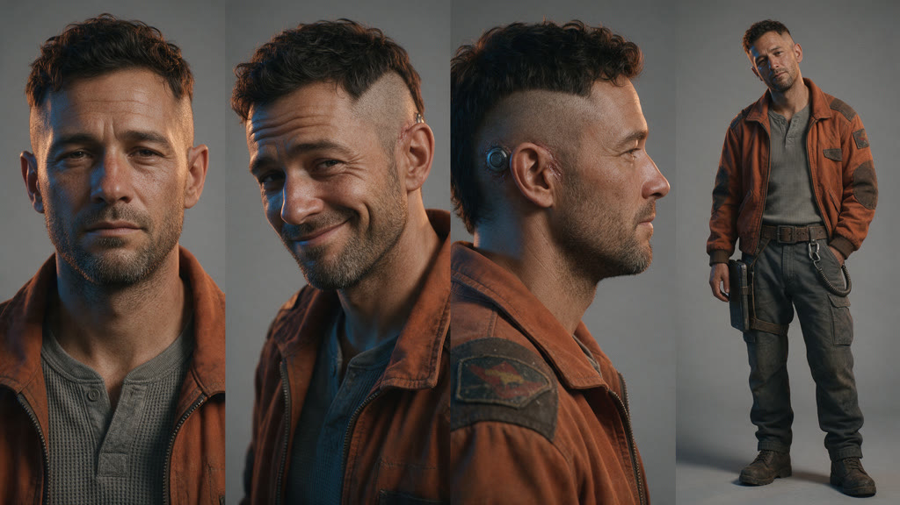
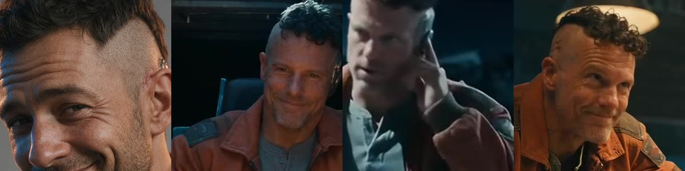
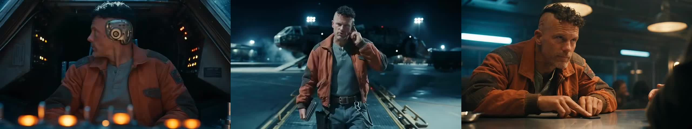

# Cass Varro: Seedance 2.5 test

**Final video:** [`../renders/final_web.mp4`](../renders/final_web.mp4) (15s, 1080p upscale, graded, ambient synth score, no narration)

## Spend
| Item | Tool | Cost |
|---|---|---|
| Reference sheet | seedream_image (Seedream v5, 2K) | $0.135 |
| 2 rejected Seedance attempts (face filter) | seedance_video 2.5 | ~$0 (fal doesn't normally bill rejected requests; this key can't read billing to confirm) |
| One 15s multi-shot clip, 3 hard cuts | seedance_video 2.5, reference-to-video, 480p | ~$3.08 |
| Score | pixabay_music, "leberch" ambient synth (free, no attribution needed) | $0 |
| **Total** | | **~$3.22 of $5** |

## How it was made
Seedance 2.5's partner filter rejected the photoreal face references twice (`partner_validation_failed`, "likenesses of real people").
So the face came from a detailed **text description**, and the only reference image was the **face-free outfit plate**.
All three scenes were made in **one 15s generation with hard cuts**, so the model carries the same person across shots.

## Reference sheet

## Face check: reference vs each shot
Left to right: reference (three-quarter), cockpit, docking bay, bar.

## Shots

## Face consistency ratings (honest)
| Shot | vs reference sheet | vs the other shots | Notes on drift |
|---|---|---|---|
| a. Cockpit (0-5.2s) | **4/10** | **8/10** (baseline) | Same type of guy (shaved side, dark curly top, grey stubble, crooked smirk), but a different face from the sheet: older, narrower, lighter eyes. The jack port is a huge chrome disc, not the small port in the brief. Smirk lands well. |
| b. Docking bay (5.2-9.8s) | **3/10** | **5/10** | Biggest drift. Hair is shorter and flatter, the face looks younger and leaner, and the jack port isn't visible. The comm reads as holding a phone to his ear. Steam is lighter than asked for. Outfit and tablet are right. |
| c. Bar (9.8-15s) | **3/10** | **6/10** | Hair and stubble match the cockpit, but the jaw is heavier and the skin redder and more lined, so he reads 5-10 years older. The chip slide and raised eyebrow both land. The contact's hand enters frame-right (fine for the story, breaks the count lock). |

**Outfit consistency: 8/10.** The jacket, patches, henley, belt, tablet and tether hold across all three shots.

**Verdict:** It looks cinematic and the brief's actions all land. As a **character-consistency** test it fails against the reference sheet, because Seedance never saw his face.
Within the one generation he stays recognisably the same guy, but drifts roughly 5-10 years in apparent age.

## Next options
- Use this Seedance face as the new canonical Cass: pull stills from the cockpit shot as his sheet, so future Seedance work matches itself (text plus the outfit plate).
- For locking to a designed face: MiniMax H3 or Gemini Omni accept face references (~$2-3 for 15s).
- Seedance with real face references needs ByteDance's asset-ID authorization via Volcengine Ark (`seedance_ark`, needs `ARK_API_KEY`).
